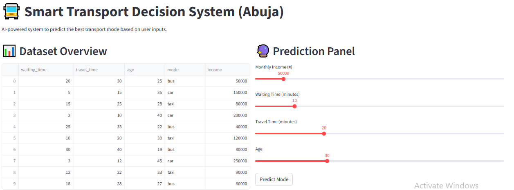
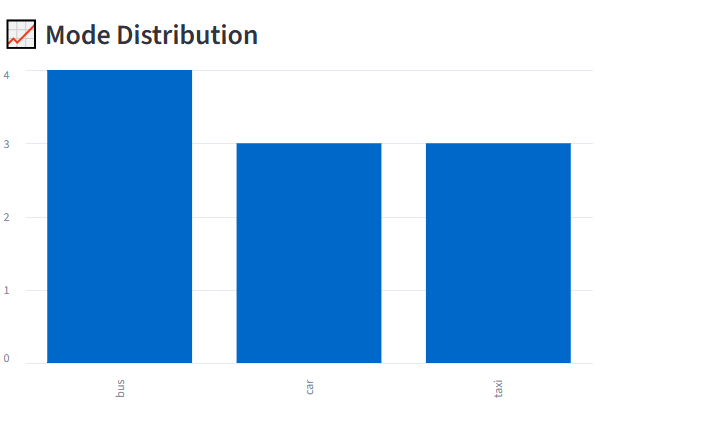
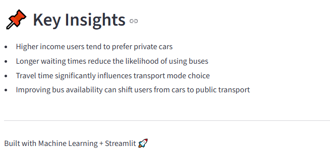

# 🚍 Smart Transport AI

An intelligent **Machine Learning-powered transport recommendation system** built with **Streamlit** that predicts the most suitable transportation mode (**Bus, Car, or Taxi**) based on user inputs such as income, waiting time, travel time, and age.

Designed to support **smart mobility decisions**, improve urban transport planning, and demonstrate the use of AI in real-world transportation systems.

---

## 🌐 Live App

🔗 https://smart-transport-ai-ysslocirwyd9m9vnkwnov4.streamlit.app/

---

## 📌 Project Overview

Urban transportation decisions depend on multiple factors such as affordability, convenience, and travel efficiency.

This application uses **Machine Learning classification** to recommend the best transport option for users based on:

- Monthly Income  
- Waiting Time  
- Travel Time  
- Age  

The system predicts one of the following:

- 🚍 Public Bus  
- 🚗 Private Car  
- 🚕 Taxi  

---

## 🚀 Features

### 📊 Dataset Overview

Displays a transport dataset containing:

- Waiting Time  
- Travel Time  
- Age  
- Income  
- Preferred Mode of Transport  

---

### 📈 Mode Distribution Visualization

Interactive bar chart showing transport mode frequency:

- Bus  
- Car  
- Taxi  

---

### 🔮 AI Prediction Panel

Users can input:

- Monthly Income  
- Waiting Time  
- Travel Time  
- Age  

And instantly receive the recommended transport mode.

---

### 📌 Key Insights Section

The dashboard provides valuable insights such as:

- Higher income users tend to prefer private cars  
- Longer waiting times reduce bus usage  
- Travel time influences transport decisions  
- Better bus systems can reduce private car usage  

---

## 🖼️ Project Screenshots

### Dashboard View


### Prediction Output


### Key Insights Section



---

## 🛠️ Tech Stack

- Python  
- Streamlit  
- Pandas  
- NumPy  
- Scikit-learn  
- Random Forest Classifier  

---

## 🤖 Machine Learning Model

**Algorithm Used:** Random Forest Classifier

The model was trained to classify transport mode based on user behavior and socioeconomic features.

### Input Features:

- Income  
- Waiting Time  
- Travel Time  
- Age  

### Target Variable:

- Mode of Transport  

---

## 📂 Project Structure

```bash
Smart-Transport-AI/
│── app1.py
│── data.csv
│── model.pkl
│── requirements.txt
│── README.md
│── assets/
│   │── Dashboard.png
│   │── Key.png
│   │── Mode.png

```

---
⚙️ Installation Guide

Clone the repository:
```bash
git clone https://github.com/yourusername/Smart-Transport-AI.git
cd Smart-Transport-AI
```
---
Install dependencies:
```bash
pip install -r requirements.txt
```
---
Run the application:
```bash
streamlit run app1.py
```

---

## 📌 Use Case Applications

- Smart Mobility Systems  
- Urban Transport Planning  
- AI Decision Support  
- Public Transport Optimization  
- Traffic Policy Simulation  
- Sustainable Transportation Research  

---

## 📈 Future Improvements

- Real-time Traffic API Integration  
- Route Recommendation System  
- Fare Prediction Engine  
- GPS Tracking Integration  
- Public Transport Demand Forecasting  
- Power BI Dashboard Version  

---

## 👨‍💻 Author

**Kolade Olonisakin**  
Data Scientist | Machine Learning Engineer | AI Enthusiast
