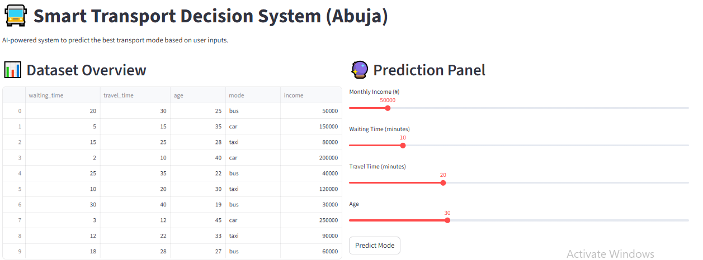
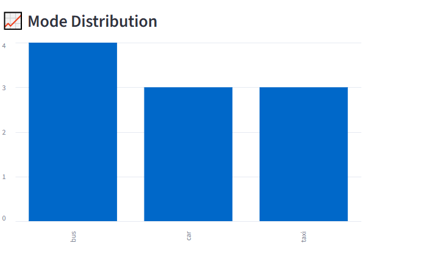
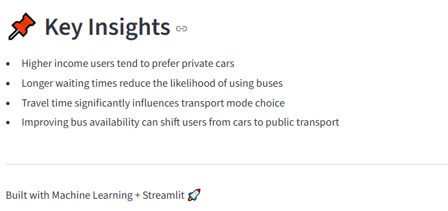

# 🚍 Smart Transport AI

An intelligent **Machine Learning-powered transport recommendation system** built with **Python, Streamlit, and Scikit-learn** that predicts the most suitable mode of transportation (**Public Bus, Private Car, or Taxi**) based on user characteristics and travel conditions.

This project demonstrates how **Artificial Intelligence, Machine Learning, and Data Analytics** can support smarter mobility decisions, improve urban transport planning, and provide intelligent decision support for sustainable transportation systems.

---

# 🌐 Live Application

🔗 https://smart-transport-ai-ysslocirwyd9m9vnkwnov4.streamlit.app/

---

# 📌 Project Overview

Choosing the most suitable mode of transportation depends on several factors including affordability, waiting time, travel time, and socioeconomic characteristics.

This application uses Machine Learning to recommend the most appropriate transportation mode based on:

- Monthly Income
- Waiting Time
- Travel Time
- Age

The system predicts one of the following transport options:

- 🚌 Public Bus
- 🚗 Private Car
- 🚕 Taxi

The project demonstrates how AI can assist commuters, transport planners, and policy makers in making more informed transportation decisions.

---

# 🚀 Key Features

## 📊 Dataset Explorer

Explore a transportation dataset containing:

- Monthly Income
- Waiting Time
- Travel Time
- Age
- Preferred Transport Mode

---

## 📈 Transport Mode Distribution

Interactive visualization showing the distribution of:

- Public Bus
- Private Car
- Taxi

This provides insight into travel behaviour across different user groups.

---

## 🤖 AI Transport Recommendation

Users enter:

- Monthly Income
- Waiting Time
- Travel Time
- Age

The application instantly recommends the most suitable transport option.

---

## 📌 Intelligent Decision Insights

The application highlights important transportation insights, including:

- Higher-income users are more likely to choose private cars.
- Longer waiting times reduce the attractiveness of public buses.
- Travel time strongly influences transport choice.
- Improving public transport services can encourage a shift away from private vehicles.

---

# 📸 Application Screenshots

## 🖥️ Dashboard



---

## 🤖 AI Recommendation



---

## 📊 Decision Insights



---

# 🧠 Machine Learning Model

## Algorithm

**Random Forest Classifier**

### Input Features

- Monthly Income
- Waiting Time
- Travel Time
- Age

### Predicted Output

- Recommended Mode of Transport

  - Public Bus
  - Private Car
  - Taxi

---

# 📊 Model Development & Key Learning

This project was developed as a prototype to demonstrate the integration of **Machine Learning, interactive analytics, and decision-support systems** within a transportation application.

Rather than focusing solely on prediction accuracy, the objective was to build a complete AI-powered system that enables users to explore transportation data, understand travel behaviour, and receive intelligent transport recommendations through an interactive Streamlit dashboard.

One important lesson from this project is that successful Machine Learning solutions depend on more than selecting an algorithm.

> **The quality, diversity, and representativeness of the training data are equally important for producing reliable and generalizable predictions.**

Future versions of this application will include larger datasets, additional socioeconomic variables, real-world transportation data, and comparisons of multiple classification algorithms to further improve prediction performance.

This project demonstrates the successful integration of:

- Machine Learning Classification
- Interactive Data Visualization
- Transportation Decision Support
- Streamlit Web Deployment
- Smart Mobility Analytics

---

# 🛠️ Technology Stack

- Python
- Streamlit
- Pandas
- NumPy
- Scikit-learn
- Random Forest Classifier

---

# 📂 Project Structure

```text
Smart-Transport-AI/
│── app1.py
│── data.csv
│── model.pkl
│── requirements.txt
│── README.md
│── assets/
│   ├── Dashboard.png
│   ├── Key.png
│   └── Mode.png
```

---

# ⚙️ Installation

## Clone Repository

```bash
git clone https://github.com/kola56de/Smart-Transport-AI.git

cd Smart-Transport-AI
```

## Install Dependencies

```bash
pip install -r requirements.txt
```

## Run the Application

```bash
streamlit run app1.py
```

---

# 🎯 Use Cases

- Smart Mobility Systems
- Transportation Decision Support
- Urban Transport Planning
- Sustainable Mobility Research
- Public Transport Optimization
- AI-Based Transport Recommendation
- Transportation Policy Analysis

---

# 📈 Future Improvements

- Real-Time Traffic API Integration
- Intelligent Route Recommendation
- Fare Prediction Engine
- GPS Tracking Integration
- Public Transport Demand Forecasting
- Power BI Executive Dashboard
- Mobile Application
- Multi-City Transport Recommendation

---

# 👨‍💻 Author

## **Engr. Dr. Kolade Olonisakin, FNSE**

**Civil Engineer | Data Scientist | Machine Learning Engineer | AI Engineer | Transportation & GIS Analytics**

🌍 **Portfolio**

https://kola56de.github.io/Engr-Dr-Kolade-Portfolio.github.io/

💼 **LinkedIn**

https://www.linkedin.com/in/engr-dr-kolade-olonisakin-fnse/

💻 **GitHub**

https://github.com/kola56de

---

# ⭐ Support

If you found this project useful, please consider giving it a **⭐ Star** on GitHub.

Feedback, suggestions, and collaboration opportunities are always welcome.
